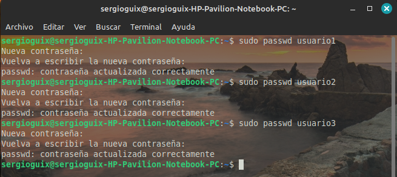
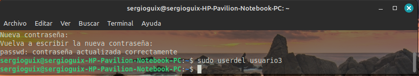

# Gestión de Usuarios, Grupos y Permisos en Linux

## Parte 1: Gestión de Usuarios

### 1. Creación de Usuarios

### 2. Asignacion de contraseña

### 3. Informacion de usuarios

### 4. Eliminacion de Usuarios

## Parte 2: Gestion de grupos

### 1. Creación de grupos

### 2. Agregar usuarios a grupos

### 3. Verificar membresia

### 4. Eliminar grupo

## Parte 3: Gestion de permisos

### 1. Creación de archivos y directorios

### 2. Verificar permisos

### 3. Modificar Permisos usando chmod con Modo Numérico

### 4. Modificar Permisos usando chmod con Modo Simbólico

### 5. Cambiar el Grupo Propietario

### 6. Configurar Permisos de Directorio

### 7. Comprobación de Acceso

### 8. Verificación Final

