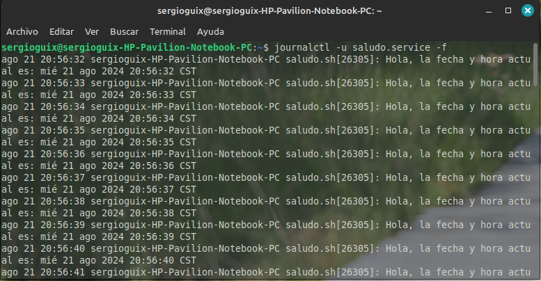

# Servicio de `systemd` que imprime un saludo y la fecha

Este servicio de `systemd` ejecuta un script en bash que imprime un saludo y la fecha infinitamente, con una pausa de un segundo entre cada impresión.

## 1. Crear el script de bash


Se guardo en el directorio /usr/local/bin/ como saludo.sh. Con permisos de ejecución:

```
sudo chmod +x /usr/local/bin/saludo.sh
```
## 2. Crear la unidad systemd

Ahora, se crea un archivo de unidad de systemd que ejecutará este script como un servicio.

```
sudo nano /etc/systemd/system/saludo.service

```

El contenido del archivo saludo.service es el siguiente:


## 3. Habilitar y ejecutar el servicio
se guarda el archivo, luego recarga systemd para que reconozca el nuevo servicio:

```
sudo systemctl daemon-reload
```
#### Habilita el servicio para que se inicie automáticamente con el sistema:

```
sudo systemctl enable saludo.service

```


#### inicia el servicio


## 4. Chequear los logs del servicio
Se verificar los logs del servicio usando journalctl:

```
journalctl -u saludo.service -f
```

