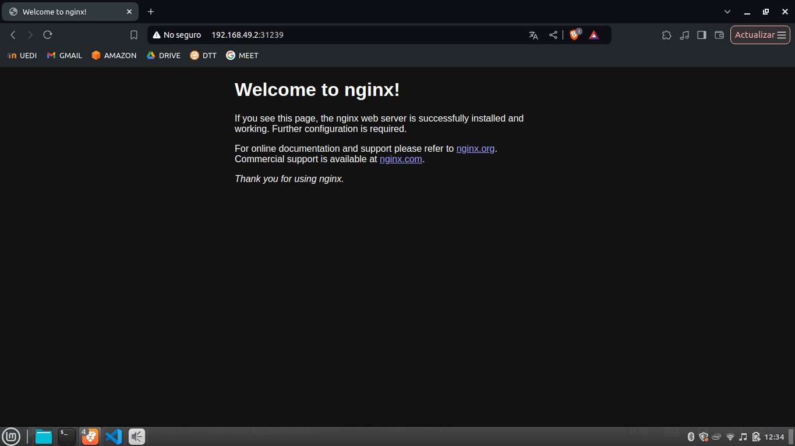

# Actividad 8

## Instalacion de Kubectl

```
curl -LO "https://dl.k8s.io/release/$(curl -L -s https://dl.k8s.io/release/stable.txt)/bin/linux/amd64/kubectl"


sudo mv ./kubectl /usr/local/bin/kubectl

kubectl version --client=true

```

## Intalacion de minikube

```
curl -LO https://storage.googleapis.com/minikube/releases/latest/minikube-linux-amd64
sudo install minikube-linux-amd64 /usr/local/bin/minikube && rm minikube-linux-amd64
```

- Veirificacion de instalacion de minikube
```
minikube version
```

# Iniciar un Clúster Local con Minikube
- Este comando descarga una máquina virtual con Kubernetes configurado y la inicia. También configurará tu kubectl para apuntar a este clúster de Minikube.

```
minikube start
```

## Verificar que el cluster este corriendo 
```
kubectl get nodes
```

# Desplegar un Contenedor Web Server Nginx

## Crear un Deployment para Nginx
- Utilizar el comando kubectl para desplegar un contenedor de Nginx:

```
kubectl create deployment nginx --image=nginx
```

- verificar que el pod de Nginx esté corriendo

```
kubectl get pods
```

## Exponer el servicio
- Para poder acceder a Nginx desde fuera del clúster (por ejemplo, desde tu navegador), necesitamos exponer este contenedor como un servicio:
```
kubectl expose deployment nginx --type=NodePort --port=80
```
## Verificar el servicio

- Ejecutar el siguiente comando para verificar qué puerto ha sido asignado

```
kubectl get services
```

## Acceder al servidor web 

```
http://192.168.49.2:31239/
```




## Limpiar el cluster
- eliminar el deployment y servicio de Nginx

```
kubectl delete service nginx
kubectl delete deployment nginx
```

## Apagar minikube
```
minikube stop
```

## Elminar el cluster de kubernetes
```
minikube delete
``` 

# Contestar a siguiente pregunta.¿En un ambiente local de Kubernetes existen los nodos masters y workers, como es que esto funciona?

***En un ambiente local de Kubernetes, como con Minikube, no hay nodos separados de master y worker. Todo el clúster, incluidos los componentes del plano de control (master) y los pods de las aplicaciones (workers), se ejecuta en una sola máquina virtual. Esta máquina actúa tanto como nodo maestro para la administración, como nodo trabajador para ejecutar las aplicaciones***